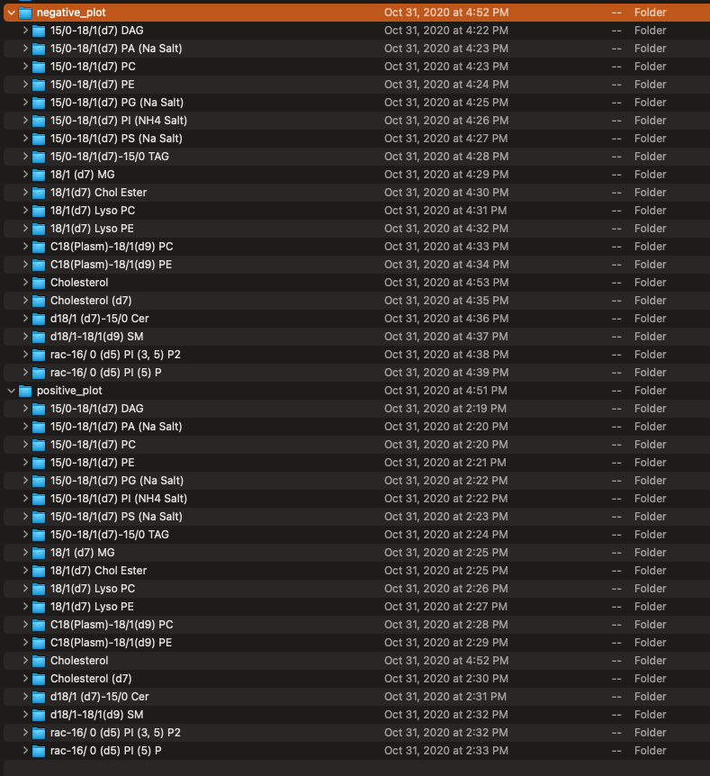

```{r setup, include=FALSE}
knitr::opts_chunk$set(echo = TRUE)
```

## Prepare data for analysis

First, create a new folder in `data` folder for all data, for example, `2020_11_12`.

### `internal_standard` for internal standard for retention time confirmation

Create a `internal_standard` folder in `2020_11_12` folder. And then create a `mzXML` folder in this folder. The mzXML data of QC samples should be placed in `POS` and `NEG` folder, respectively.


The second file, the table of internal standard (xlsx format) should also be placed in this folder. The table should be like this:


### `IS_quantification` for Quantification for internal standard

Create a `IS_quantification` folder in `2020_11_12` folder and then put all the mzXML of samples in the `POS` and `NEG` folder, respectivey.


### `lipid_search_quantification` for quantification for all the lipids

Create a `lipid_search_quantification` folder in `2020_11_12` folder

The peak table (csv) from `lipidSearch` should be placed in one folder named as `lipid_search`, and then put all the lipid table from lipid search into `POS` and `NEG`, respectively.


----

## Data analysis

### `step0_parameter_setting.R`: RT confirmation for internal standards

Open the code folder `R/20201111`. Open the `step0_parameter_setting.R`, and then set the parameters for this analysis.

1. `file_path`: the folder that contains all the data, for example "2020_11_12".

2. `is_table_name`: the name of internal standard table.

3. `lipid_data_pos_name`: the name of lipid table (positive mode) from lipid search and this table should be in `2020-11-12/lipid_search_quantification/POS`.

4. `lipid_data_neg_name`: the name of lipid table (negative mode) from lipid search and this table should be in `2020-11-12/lipid_search_quantification/NEG`.

### `step1_internal_standard_RT_confirmation.R`: Extract peaks of internal standards in QC samples

Open the code folder `R/20201111`. Open the `step1_internal_standard_RT_confirmation.R`, and then run code row by row.

After all analysis is done, all the plots of internal standards with different adducts are generated in the `positive_plot` and `negative_plot` folders.




Then please open the internal standard table and then refill the `RT NEG (min)`, `Adduct NEG`, `RT POS (second)`, `RT NEG (second)` according to the peak shapes plot.


### `step2_internal_standard_quantification.R`: Relative quantification for internal standards

Copy the internal standard table you have filled rt and adduct to `IS_quantification/POS` and `IS_quantification/NEG`.

Open the `step2_internal_standard_quantification.R` and then run code row by row. For positive and negative mode, the quantification tables are generated to `POS` and `NEG` folders with name `quantification_data_final.xlsx`.


### `step3_lipid_search_quantification.R`: Relative quantification for lipid table from lipid search

Open the `step3_lipid_search_quantification.R` and then run code row by row. For positive and negative mode, the quantification tables are generated to `POS` and `NEG` folders with name `quantification_data_final.xlsx`.

### `step4_absolute_quantification.R`: Absolute quantification

Open the `step4_absolute_quantification.R` and then run code row by row. 

### `step5_combine_pos_neg.R`: Combine positive and negative bbsolute quantification

Open the `step5_combine_pos_neg.R` and then run code row by row. Then all the results are generated in `absolute_quantification/Result` folder.

1. `lipid_data_um.csv`: Absolute quantification for lipid in um. 


2. `lipid_data_ug_ml.csv`: Absolute quantification for lipid in ug/ml.

3. `lipid_data_class_um.csv`: Absolute quantification for lipid class in um.

4. `lipid_data_class_ug_ml.csv`: Absolute quantification for lipid class in ug/ml.

5. `lipid_data_um_per.csv`:  Absolute quantification for lipid class in um percentage.

6. `lipid_data_class_um_per.csv`:  Absolute quantification for lipid class in ug.ml percentage.

### `step6_tidy_peaks_plot.R`: Reorganize the peak plot and integrate plot.

Open the `step6_tidy_peaks_plot.R` and then run code row by row. Then all the results are generated in `absolute_quantification/Result` folder.